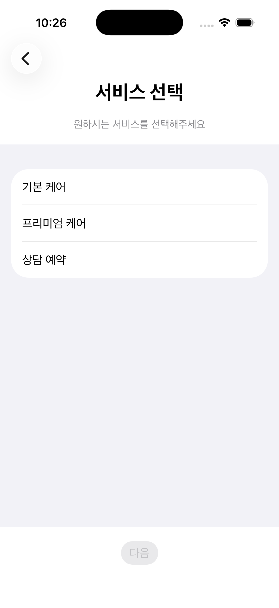
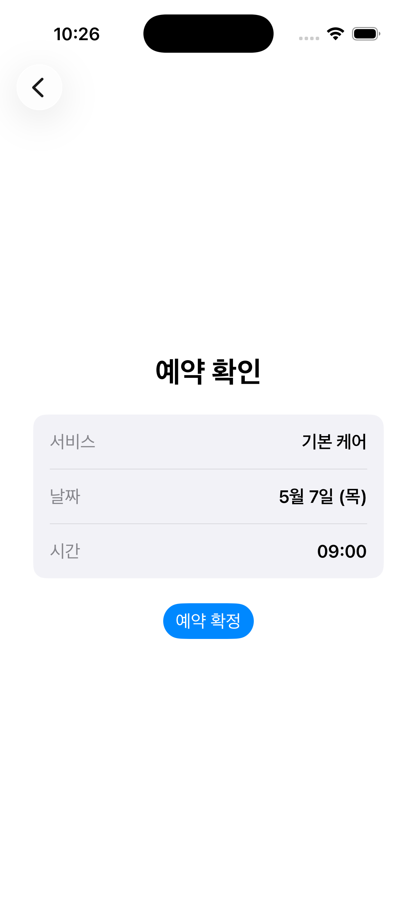
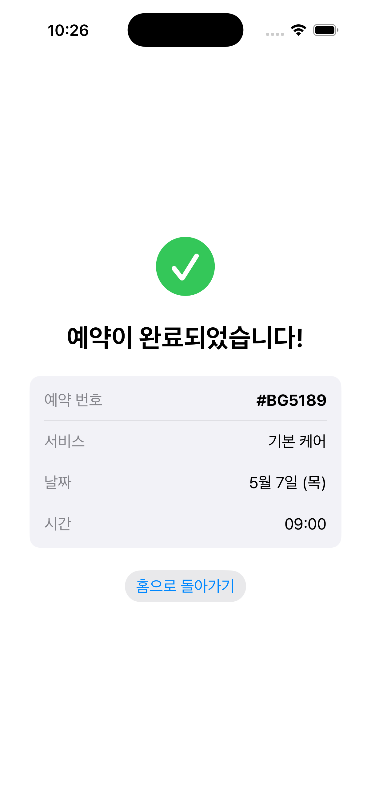
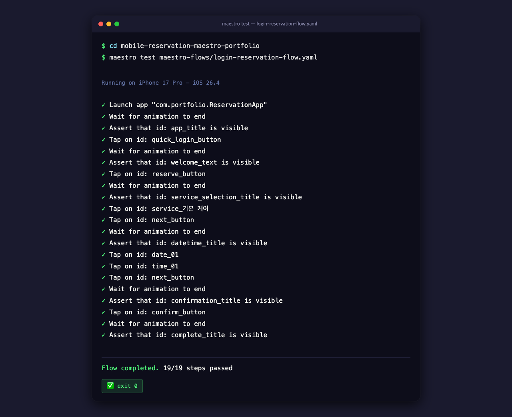

# Portfolio Summary: iOS Mobile Reservation E2E Test Automation

> **프로젝트:** SwiftUI 예약 미니 앱 + Maestro E2E 테스트 자동화  
> **버전:** v1.0.0  
> **실행 검증:** iOS Real Execution Verified ✅  
> **검증일:** 2026-05-06

---

## Overview

This portfolio demonstrates **end-to-end mobile test automation** using Maestro on a SwiftUI iOS application. The app implements a complete reservation flow (login → service selection → date/time pick → confirmation → complete), and Maestro validates every step on a real iOS Simulator.

## Key Results

| Metric | Value |
|--------|-------|
| **Test Framework** | Maestro 2.5.1 |
| **Target Device** | iPhone 17 Pro Simulator, iOS 26.4 |
| **Flow Steps** | 19 |
| **Pass Rate** | 19/19 ✅ (100%) |
| **Exit Code** | 0 (clean) |
| **Repeated Runs** | 3 consecutive passes |

## App Screens Flow

| Step | Screen | Verified Element |
|:----:|:-------|:-----------------|
| 1 | **Login Screen** | `app_title` — 앱 타이틀 확인 |
| 2 | **Home Screen** | `welcome_text` — "환영합니다!" 표시 |
| 3 | **Service Selection** | `service_selection_title` — 서비스 선택 화면 |
| 4 | **Date/Time Selection** | `datetime_title` — 날짜/시간 선택 화면 |
| 5 | **Confirmation** | `confirmation_title` — 예약 정보 확인 |
| 6 | **Complete** | `complete_title` — 예약 완료! |

## Screenshots

| Preview | Screen | File |
|:-------:|:-------|:-----|
|  | Login Screen | `screenshots/01-login.png` |
|  | Home Screen | `screenshots/02-home.png` |
|  | Service Selection | `screenshots/03-service-selection.png` |
|  | Date/Time Selection | `screenshots/04-date-time-selection.png` |
|  | Confirmation | `screenshots/05-confirmation.png` |
|  | Complete | `screenshots/06-complete.png` |
|  | Maestro Terminal (19/19 ✅) | `screenshots/07-maestro-run-completed.png` |

## Technical Stack

```
SwiftUI  →  iOS App (6 Screens)
XcodeGen →  Project Generation (project.yml)
Maestro  →  E2E Test Automation (19-step Flow)
Java 17  →  Maestro runtime dependency
```

## Key Finding: SwiftUI SecureField + Maestro inputText

A critical real-world discovery: Maestro's `inputText` command appears to succeed on SwiftUI's `SecureField` (logs COMPLETED), but the `@State` binding **is not updated**. This means login form validation always fails even though the text is visible on screen.

**Solution:** A `quick_login_button` accessibility bypass — a test-only login path using `.accessibilityIdentifier("quick_login_button")` — is included in the app. This button directly sets `showHome = true`, bypassing the SecureField entirely. It's designed for debug/test builds only.

Full details documented in: [maestro SKILL.md Section 10](https://github.com/Caixa-git/hermes-naruhodo/blob/main/SKILL.md) (private repo).

## Deliverables

| Artifact | Description |
|:---------|:------------|
| `Sources/ReservationApp/` | SwiftUI app source (6 screens + models) |
| `maestro-flows/login-reservation-flow.yaml` | 19-step E2E Maestro flow |
| `screenshots/` | 7 screenshots (6 app screens + 1 terminal result) |
| `README.md` | Project overview, execution guide, verification status |
| `SKILL.md` | Hermes-Maestro Skill document (Korean, all sections) |
| `templates/maestro-test-report.md` | E2E test report template |
| `examples/maestro-flow-example.yaml` | Example Maestro flow with scrollUntilVisible pattern |
| `outputs/cycle-01/` | Full cycle report, QA results, execution report, verification matrix |

---

**Verification Badge:** ✅ iOS Real Execution Verified  
**Portfolio Repo:** Caixa-git/mobile-reservation-maestro-portfolio (private)  
**Run Command:** `maestro test maestro-flows/login-reservation-flow.yaml`
