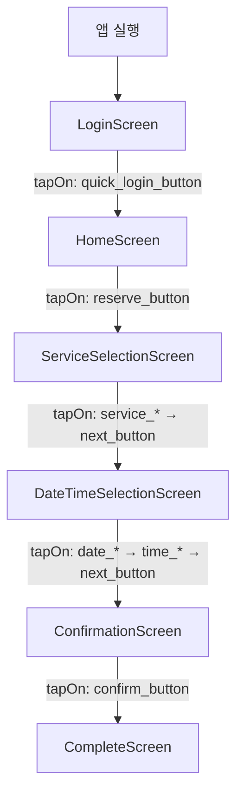

# Maestro E2E 테스트 실행 보고서

> **Flow:** `<flow-name>.yaml`  
> **실행일:** `YYYY-MM-DD`  
> **최종 결과:** `✅ ALL COMPLETED / ❌ FAILED`  
> **버전:** v1.0.0

---

## 1. 실행 환경 (Execution Environment)

| 항목 | 값 |
|------|-----|
| **OS** | macOS (Apple Silicon) |
| **Device** | iPhone 17 Pro Simulator, iOS 26.4 |
| **Java** | OpenJDK 17.0.19 |
| **Maestro** | 2.5.1 |
| **App Bundle ID** | `com.portfolio.ReservationApp` |
| **프로젝트 생성** | XcodeGen (project.yml) |
| **Xcode** | Xcode 16+ (iOS 26.4 SDK) |

---

## 2. 실행 명령어 (Execution Command)

```bash
cd <repo-path>
maestro test maestro-flows/<flow-name>.yaml
```

### 사전 준비 (Prerequisites)

```bash
# 1. XcodeGen으로 프로젝트 생성
xcodegen generate

# 2. Xcode에서 빌드 및 시뮬레이터 실행 (⌘R)

# 3. 시뮬레이터 부팅 (필요 시)
xcrun simctl boot "iPhone 17 Pro"
```

---

## 3. Flow 개요 (Flow Overview)

**파일:** `maestro-flows/<flow-name>.yaml`

```yaml
appId: com.portfolio.ReservationApp
---
# 전체 Flow 요약 — 실제 내용은 YAML 파일 참조
```

**전체 Step 수:** `<N>`  
**예상 실행 시간:** `<N>`초

---

## 4. Step별 실행 결과 (Step-by-Step Execution Results)

| Step # | 동작 | 명령어 | 결과 | 실행 시간 |
|--------|------|--------|:----:|:---------:|
| 1 | `<description>` | `<command>` | ✅ **COMPLETED** | `<N>ms` |
| 2 | `<description>` | `<command>` | ✅ **COMPLETED** | `<N>ms` |
| ... | ... | ... | ... | ... |
| N | `<description>` | `<command>` | ✅ **COMPLETED** | `<N>ms` |

> **참고:** `scrollUntilVisible` fallback이 적용된 Step은 iOS 26.4 접근성 호환성 우회 패턴이 포함되어 있습니다.

---

## 5. 종합 실행 결과 (Overall Execution Summary)

| 지표 | 값 |
|------|:---:|
| 전체 Step 수 | `<N>` |
| 완료 (COMPLETED) | **`<N>` (100%)** |
| 실패 (FAILED) | `<N>` |
| 건너뜀 (SKIPPED) | `<N>` |
| 총 실행 시간 | `<N>`초 |
| 종료 코드 | `<0 / non-zero>` |
| 반복 실행 횟수 | `<N>`회 |

---

## 6. 화면 전환 흐름 (Screen Transition Flow)



---

## 7. 발생한 이슈 상세 (Issue Details)

### ISS-<N>: <Issue Title>

| 항목 | 내용 |
|------|------|
| **심각도** | `🔴 높음 / 🟡 중간 / 🟢 낮음` |
| **증상** | `<issue symptom description>` |
| **원인** | `<root cause analysis>` |
| **해결 방안** | `<resolution or workaround>` |
| **영향 범위** | `<scope of impact>` |
| **현재 상태** | `✅ 해결됨 / ⚠️ 우회 조치 / ❌ 미해결` |

### ISS-<N+1>: <Issue Title>

| 항목 | 내용 |
|------|------|
| ... | ... |

---

## 8. 스크린샷 (Screenshots)

| 단계 | 설명 | 스크린샷 |
|:----:|:-----|:--------:|
| 01 | **Login Screen** — 앱 실행 후 로그인 화면 | `` |
| 02 | **Home Screen** — 빠른 로그인 후 환영 메시지 | `` |
| 03 | **Service Selection** — 서비스 유형 선택 | `` |
| 04 | **Date/Time Selection** — 날짜 및 시간 선택 | `` |
| 05 | **Confirmation** — 예약 정보 확인 | `` |
| 06 | **Complete** — 예약 완료 화면 | `` |
| 07 | **Maestro 실행 결과** — 터미널 전체 로그 | `` |

---

## 9. iOS 26.4 접근성 Workarounds 적용 현황

| Workaround | 적용 대상 | 설명 | 상태 |
|:-----------|:---------|:-----|:----:|
| `scrollUntilVisible` fallback | 네비게이션 후 첫 번째 요소 | SwiftUI 트랜지션 타이밍 이슈 우회 | ✅ 적용됨 |
| `quick_login_button` | 로그인 화면 | SecureField + inputText 호환성 문제 우회 | ✅ 적용됨 |

---

## 10. 검증 체크리스트 (Verification Checklist)

| 검증 항목 | 상태 |
|-----------|:----:|
| 앱 실행 가능 | ✅ / ❌ |
| 로그인 화면 표시 | ✅ / ❌ |
| 빠른 로그인 동작 | ✅ / ❌ |
| 홈 화면 이동 | ✅ / ❌ |
| 예약하기 버튼 동작 | ✅ / ❌ |
| 서비스 선택 동작 | ✅ / ❌ |
| 날짜/시간 선택 동작 | ✅ / ❌ |
| 예약 확인 화면 표시 | ✅ / ❌ |
| 예약 확정 동작 | ✅ / ❌ |
| 예약 완료 화면 표시 | ✅ / ❌ |
| Maestro Flow 전체 실행 | ✅ / ❌ |
| 민감정보 없음 | ✅ / ❌ |
| 실제 고객 데이터 없음 | ✅ / ❌ |

---

## 11. 권장 사항 (Recommendations)

1. `<recommendation 1>`
2. `<recommendation 2>`
3. `<recommendation 3>`

---

## 부록: 실행 환경 상세 (Environment Details)

### macOS

```
$ sw_vers
ProductName:    macOS
ProductVersion: 14.x (Apple Silicon)
BuildVersion:   ...
```

### Java

```
$ java -version
openjdk version "17.0.19" 2024-04-16
OpenJDK Runtime Environment (build 17.0.19+7)
OpenJDK 64-Bit Server VM (build 17.0.19+7, mixed mode)
```

### Maestro

```
$ maestro --version
Version: 2.5.1
```

### 시뮬레이터

```
$ xcrun simctl list | grep "iPhone 17 Pro"
    iPhone 17 Pro (UUID) (Booted)
    iOS 26.4
```

---

> **보고서 생성 도구:** Hermes Agent (Nous Research)  
> **템플릿 버전:** v1.0.0  
> **관련 저장소:** [mobile-reservation-maestro-portfolio](https://github.com/Caixa-git/mobile-reservation-maestro-portfolio)
